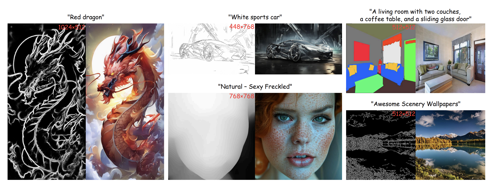
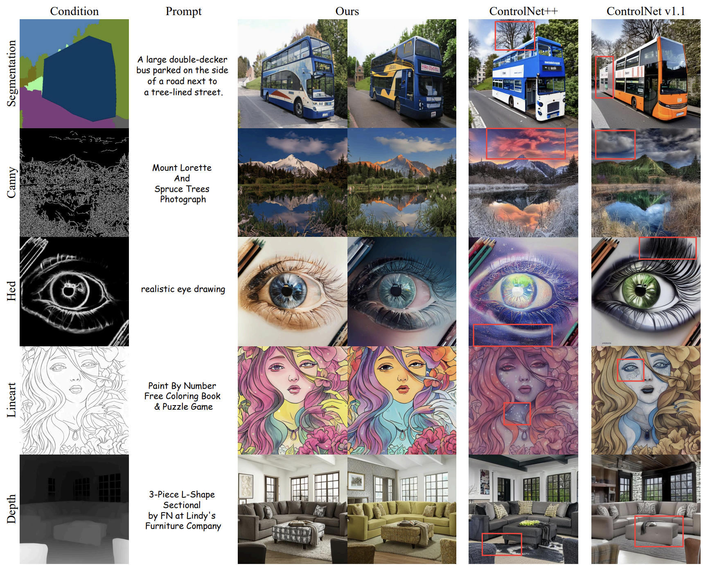

<div align ="center">

<h1> ControlAR </h1>
<h3> Controllable Image Generation with Autoregressive Models </h3>

Zongming Li<sup>1,\*</sup>, [Tianheng Cheng](https://scholar.google.com/citations?user=PH8rJHYAAAAJ&hl=zh-CN)<sup>1,\*</sup>, [Shoufa Chen](https://shoufachen.com/)<sup>2</sup>, [Peize Sun](https://peizesun.github.io/)<sup>2</sup>, Haocheng Shen<sup>3</sup>,Longjin Ran<sup>3</sup>, Xiaoxin Chen<sup>3</sup>, [Wenyu Liu](http://eic.hust.edu.cn/professor/liuwenyu)<sup>1</sup>, [Xinggang Wang](https://xwcv.github.io/)<sup>1,📧</sup>

<sup>1</sup> Huazhong University of Science and Technology,
<sup>2</sup> The University of Hong Kong
<sup>3</sup> vivo AI Lab

(\* equal contribution, 📧 corresponding author)

[](https://arxiv.org/abs/2410.02705)
[](https://huggingface.co/wondervictor/ControlAR)

</div>


<div align="center">

</div>


## News
`[2024-12-12]:` We introduce control strength factor, employ a larger control encoder(dinov2-base), and optimize text alignment capabilities along with generation diversity. New model weight: depth_base.safetensors and edge_base.safetensors. The edge_base.safetensors can handle three types of edges, including Canny, HED, and Lineart.\
`[2024-10-31]:` The code and models have been released!\
`[2024-10-04]:` We have released the [technical report of ControlAR](https://arxiv.org/abs/2410.02705). Code, models, and demos are coming soon!


## Highlights

* ControlAR explores an effective yet simple *conditional decoding* strategy for adding spatial controls to autoregressive models, e.g., [LlamaGen](https://github.com/FoundationVision/LlamaGen), from a sequence perspective.

* ControlAR supports *arbitrary-resolution* image generation with autoregressive models without hand-crafted special tokens or resolution-aware prompts.

## TODO

- [x] release code & models.
- [ ] release demo code and HuggingFace demo.


## Results

We provide both quantitative and qualitative comparisons with diffusion-based methods in the technical report! 

<div align="center">

</div>


## Models

We released checkpoints of text-to-image ControlAR on different controls and settings, *i.e.* arbitrary-resolution generation.

| AR Model | Type | Control | Arbitrary-Resolution | Checkpoint |
| :--------| :--: | :-----: | :------------------: | :--------: |
| [LlamaGen-XL](https://github.com/FoundationVision/LlamaGen#-text-conditional-image-generation) | t2i | Canny Edge | ✅ | [ckpt](https://huggingface.co/wondervictor/ControlAR/blob/main/canny_MR.safetensors) |
| [LlamaGen-XL](https://github.com/FoundationVision/LlamaGen#-text-conditional-image-generation) | t2i | Depth | ✅ | [ckpt](https://huggingface.co/wondervictor/ControlAR/blob/main/depth_MR.safetensors) |
| [LlamaGen-XL](https://github.com/FoundationVision/LlamaGen#-text-conditional-image-generation) | t2i | HED Edge | ❌ | [ckpt](https://huggingface.co/wondervictor/ControlAR/blob/main/hed.safetensors) |
| [LlamaGen-XL](https://github.com/FoundationVision/LlamaGen#-text-conditional-image-generation) | t2i | Seg. Mask | ❌ | [ckpt](https://huggingface.co/wondervictor/ControlAR/blob/main/seg_cocostuff.safetensors) |


## Getting Started

### Installation

```bash
conda create -n ControlAR python=3.10
git clone https://github.com/hustvl/ControlAR.git
cd ControlAR
pip install torch==2.1.2+cu118 --extra-index-url https://download.pytorch.org/whl/cu118
pip install -r requirements.txt
pip3 install -U openmim 
mim install mmengine 
mim install "mmcv==2.1.0"
pip3 install "mmsegmentation>=1.0.0"
pip3 install mmdet
git clone https://github.com/open-mmlab/mmsegmentation.git
```

### Pretrained Checkpoints for ControlAR

|tokenizer| text encoder |LlamaGen-B|LlamaGen-L|LlamaGen-XL|
|:-------:|:------------:|:--------:|:--------:|:---------:|
|[vq_ds16_t2i.pt](https://huggingface.co/peizesun/llamagen_t2i/resolve/main/vq_ds16_t2i.pt)|[flan-t5-xl](https://huggingface.co/google/flan-t5-xl)|[c2i_B_256.pt](https://huggingface.co/FoundationVision/LlamaGen/resolve/main/c2i_B_256.pt)|[c2i_L_256.pt](https://huggingface.co/FoundationVision/LlamaGen/resolve/main/c2i_L_256.pt)|[t2i_XL_512.pt](https://huggingface.co/peizesun/llamagen_t2i/resolve/main/t2i_XL_stage2_512.pt)|

We recommend storing them in the following structures:
```
|---checkpoints
      |---t2i
            |---canny/canny_MR.safetensors
            |---hed/hed.safetensors
            |---depth/depth_MR.safetensors
            |---seg/seg_cocostuff.safetensors
            |---edge_base.safetensors
            |---depth_base.safetensors
      |---t5-ckpt
            |---flan-t5-xl
                  |---config.json
                  |---pytorch_model-00001-of-00002.bin
                  |---pytorch_model-00002-of-00002.bin
                  |---pytorch_model.bin.index.json
                  |---tokenizer.json
      |---vq
            |---vq_ds16_c2i.pt
            |---vq_ds16_t2i.pt
      |---llamagen (Only necessary for training)
            |---c2i_B_256.pt
            |---c2i_L_256.pt
            |---t2i_XL_stage2_512.pt
```

### Demo

Coming soon...


###  Sample & Generation

#### 1. Class-to-image genetation

```bash
python autoregressive/sample/sample_c2i.py \
--vq-ckpt checkpoints/vq/vq_ds16_c2i.pt \
--gpt-ckpt checkpoints/c2i/canny/LlamaGen-L.pt \
--gpt-model GPT-L --seed 0 --condition-type canny
```

#### 2. Text-to-image generation

*Generate an image using HED edge and text-to-image ControlAR:*

```bash
python autoregressive/sample/sample_t2i.py \
--vq-ckpt checkpoints/vq/vq_ds16_t2i.pt \
--gpt-ckpt checkpoints/t2i/hed/hed.safetensors \
--gpt-model GPT-XL --image-size 512 \
--condition-type hed --seed 0 --condition-path condition/example/t2i/multigen/eye.png
```
*Generate an image using segmentation mask and text-to-image ControlAR:*

```bash
python autoregressive/sample/sample_t2i.py \
--vq-ckpt checkpoints/vq/vq_ds16_t2i.pt \
--gpt-ckpt checkpoints/t2i/seg/seg_cocostuff.safetensors \
--gpt-model GPT-XL --image-size 512 \
--condition-type seg --seed 0 --condition-path condition/example/t2i/cocostuff/doll.png \
--prompt 'A stuffed animal wearing a mask and a leash, sitting on a pink blanket'
```

#### 3. Text-to-image generation with adjustable control strength
*Generate an image using depth map and text-to-image ControlAR:*

```bash
python autoregressive/sample/sample_t2i.py \
--vq-ckpt checkpoints/vq/vq_ds16_t2i.pt \
--gpt-ckpt checkpoints/t2i/depth_base.safetensors \
--gpt-model GPT-XL --image-size 512 \
--condition-type seg --seed 0 --condition-path condition/example/t2i/multigen/bird.jpg \
--prompt 'A bird made of blue crystal' \
--adapter-size base \
--control-strength 0.6
```

*Generate an image using lineart edge and text-to-image ControlAR:*

```bash
python autoregressive/sample/sample_t2i.py \
--vq-ckpt checkpoints/vq/vq_ds16_t2i.pt \
--gpt-ckpt checkpoints/t2i/edge_base.safetensors \
--gpt-model GPT-XL --image-size 512 \
--condition-type lineart --seed 0 --condition-path condition/example/t2i/multigen/girl.jpg \
--prompt 'A girl with blue hair' \
--adapter-size base \
--control-strength 0.6
```


#### 4. Arbitrary-resolution generation

```bash
python3 autoregressive/sample/sample_t2i_MR.py --vq-ckpt checkpoints/vq/vq_ds16_t2i.pt \
--gpt-ckpt checkpoints/t2i/depth_MR.safetensors --gpt-model GPT-XL --image-size 768 \
--condition-type depth --condition-path condition/example/t2i/multi_resolution/bird.jpg \
--prompt 'colorful bird' --seed 0
```

```bash
python3 autoregressive/sample/sample_t2i_MR.py --vq-ckpt checkpoints/vq/vq_ds16_t2i.pt \
--gpt-ckpt checkpoints/t2i/canny_MR.safetensors --gpt-model GPT-XL --image-size 768 \
--condition-type canny --condition-path condition/example/t2i/multi_resolution/bird.jpg \
--prompt 'colorful bird' --seed 0
```

### Preparing Datasets
We provide the dataset datails for evaluation and training. If you don't want to train ControlAR, just download the validation splits.

#### 1. Class-to-image
* Download [ImageNet](https://image-net.org/) and save it to `data/imagenet/data`.

#### 2. Text-to-image
* Download [ADE20K with caption](https://huggingface.co/datasets/limingcv/Captioned_ADE20K)(~7GB) and save the `.parquet` files to `data/Captioned_ADE20K/data`. 
* Download [COCOStuff with caption](https://huggingface.co/datasets/limingcv/Captioned_COCOStuff)( ~62GB) and save the .parquet files to `data/Captioned_COCOStuff/data`.  
* Download [MultiGen-20M](https://huggingface.co/datasets/limingcv/MultiGen-20M_depth)( ~1.22TB) and save the .parquet files to `data/MultiGen20M/data`.  

#### 3. Preprocessing datasets
To save training time, we adopt the tokenizer to pre-process the images with the text prompts.

* ImageNet
```bash
bash scripts/autoregressive/extract_file_imagenet.sh \
--vq-ckpt checkpoints/vq/vq_ds16_c2i.pt \
--data-path data/imagenet/data/val \
--code-path data/imagenet/val/imagenet_code_c2i_flip_ten_crop \
--ten-crop --crop-range 1.1 --image-size 256
```
* ADE20k
```sh
bash scripts/autoregressive/extract_file_ade.sh \
--vq-ckpt checkpoints/vq/vq_ds16_t2i.pt \
--data-path data/Captioned_ADE20K/data --code-path data/Captioned_ADE20K/val \
--ten-crop --crop-range 1.1 --image-size 512 --split validation
```
* COCOStuff
```bash
bash scripts/autoregressive/extract_file_cocostuff.sh \
--vq-ckpt checkpoints/vq/vq_ds16_t2i.pt \
--data-path data/Captioned_COCOStuff/data --code-path data/Captioned_COCOStuff/val \
--ten-crop --crop-range 1.1 --image-size 512 --split validation
```
* MultiGen
```bash
bash scripts/autoregressive/extract_file_multigen.sh \
--vq-ckpt checkpoints/vq/vq_ds16_t2i.pt \
--data-path data/MultiGen20M/data --code-path data/MultiGen20M/val \
--ten-crop --crop-range 1.1 --image-size 512 --split validation
```

### Testing and Evaluation

#### 1. Class-to-image generation on ImageNet

```bash
bash scripts/autoregressive/test_c2i.sh \
--vq-ckpt ./checkpoints/vq/vq_ds16_c2i.pt \
--gpt-ckpt ./checkpoints/c2i/canny/LlamaGen-L.pt \
--code-path /path/imagenet/val/imagenet_code_c2i_flip_ten_crop \
--gpt-model GPT-L --condition-type canny --get-condition-img True \
--sample-dir ./sample --save-image True
```

```bash
python create_npz.py --generated-images ./sample/imagenet/canny
```
Then download imagenet [validation data](https://openaipublic.blob.core.windows.net/diffusion/jul-2021/ref_batches/imagenet/256/VIRTUAL_imagenet256_labeled.npz) which contains 10000 images, or you can use the whole validation data as reference data by running [val.sh](scripts/tokenizer/val.sh). 

Calculate the FID score:
```bash
python evaluations/c2i/evaluator.py /path/imagenet/val/FID/VIRTUAL_imagenet256_labeled.npz \
sample/imagenet/canny.npz
```

#### 2. Text-to-image generation on ADE20k

Download Mask2Former([weight](https://download.openmmlab.com/mmsegmentation/v0.5/mask2former/mask2former_swin-l-in22k-384x384-pre_8xb2-160k_ade20k-640x640/mask2former_swin-l-in22k-384x384-pre_8xb2-160k_ade20k-640x640_20221203_235933-7120c214.pth)) and save it to `evaluations/`.  

Use this command to get 2000 images based on the segmentation mask:

```bash
bash scripts/autoregressive/test_t2i.sh --vq-ckpt checkpoints/vq/vq_ds16_t2i.pt \
--gpt-ckpt checkpoints/t2i/seg/seg_ade20k.pt \
--code-path data/Captioned_ADE20K/val --gpt-model GPT-XL --image-size 512 \
--sample-dir sample/ade20k --condition-type seg --seed 0
```
Calculate mIoU of the segmentation masks from the generated images:
```sh
python evaluations/ade20k_mIoU.py
```

#### 3. Text-to-image generation on COCOStuff

Download DeepLabV3([weight](https://download.openmmlab.com/mmsegmentation/v0.5/deeplabv3/deeplabv3_r101-d8_512x512_4x4_320k_coco-stuff164k/deeplabv3_r101-d8_512x512_4x4_320k_coco-stuff164k_20210709_155402-3cbca14d.pth)) and save it to `evaluations/`.

Generate images using segmentation masks as condition controls:
```bash
bash scripts/autoregressive/test_t2i.sh --vq-ckpt checkpoints/vq/vq_ds16_t2i.pt \
--gpt-ckpt checkpoints/t2i/seg/seg_cocostuff.pt \
--code-path data/Captioned_COCOStuff/val --gpt-model GPT-XL --image-size 512 \
--sample-dir sample/cocostuff --condition-type seg --seed 0
```
Calculate mIoU of the segmentation masks from the generated images:
```bash
python evaluations/cocostuff_mIoU.py
```

#### 4. Text-to-image generation on MultiGen-20M

We adopt **generation with HED edges** as the example:

Generate 5000 images based on the HED edges generated from validation images
```sh
bash scripts/autoregressive/test_t2i.sh --vq-ckpt checkpoints/vq/vq_ds16_t2i.pt \
--gpt-ckpt checkpoints/t2i/hed/hed.safetensors --code-path data/MultiGen20M/val \
--gpt-model GPT-XL --image-size 512 --sample-dir sample/multigen/hed \
--condition-type hed --seed 0
```

Evaluate the conditional consistency (SSIM):
```bash
python evaluations/hed_ssim.py
```
Calculate the FID score:
```bash
python evaluations/clean_fid.py --val-images data/MultiGen20M/val/image --generated-images sample/multigen/hed/visualization
```

### Training ControlAR

#### 1. Class-to-image (Canny)

```bash
bash scripts/autoregressive/train_c2i_canny.sh --cloud-save-path output \
--code-path data/imagenet/train/imagenet_code_c2i_flip_ten_crop \
--image-size 256 --gpt-model GPT-B --gpt-ckpt checkpoints/llamagen/c2i_B_256.pt
```

#### 2. Text-to-image (Canny)

```bash
bash scripts/autoregressive/train_t2i_canny.sh 
```


## Acknowledgments

The development of ControlAR is based on [LlamaGen](https://github.com/FoundationVision/LlamaGen), [ControlNet](https://github.com/lllyasviel/ControlNet), [ControlNet++](https://github.com/liming-ai/ControlNet_Plus_Plus), and [AiM](https://github.com/hp-l33/AiM), and we sincerely thank the contributors for thoese great works!

## Citation
If you find ControlAR is useful in your research or applications, please consider giving us a star 🌟 and citing it by the following BibTeX entry.

```bibtex
@article{li2024controlar,
      title={ControlAR: Controllable Image Generation with Autoregressive Models}, 
      author={Zongming Li, Tianheng Cheng, Shoufa Chen, Peize Sun, Haocheng Shen, Longjin Ran, Xiaoxin Chen, Wenyu Liu, Xinggang Wang},
      year={2024},
      eprint={2410.02705},
      archivePrefix={arXiv},
      primaryClass={cs.CV},
      url={https://arxiv.org/abs/2410.02705}, 
}
```

